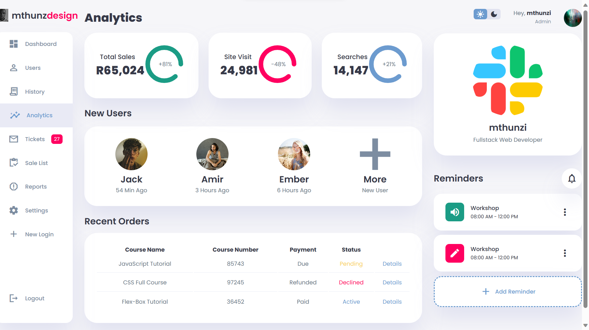
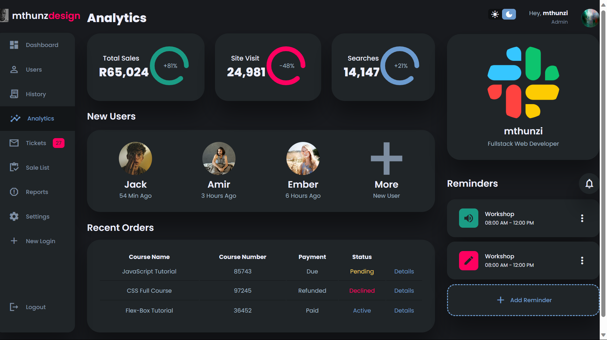

# Responsive Dashboard Design #1

a completely responsive admin dashboard with light and dark mode theme functionality. was using CSS Variables, CSS Grid, CSS Flexbox, Media queries for our responsive design, and CSS transitions and animations for some cool animation effects.

# Screenshot

Here project screenshot :

